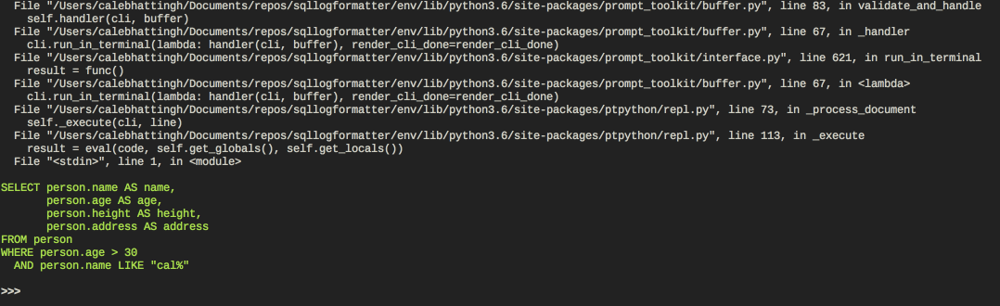
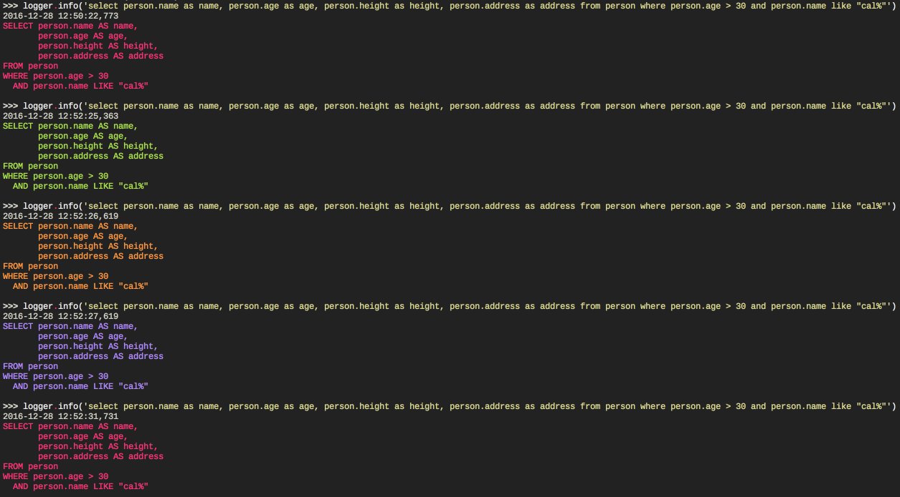

# sqllogformatter

A Python logging Formatter subclass for messages with SQL queries. This
package is intended for use during development, not production.

## Demo

```python
>>> import logging
>>> handler = logging.StreamHandler()
>>> from sqllogformatter import SQLLogFormatter
>>> formatter = SQLLogFormatter(fmt='%(asctime)s\n%(message)s\n')
>>> handler.setFormatter(formatter)
>>> logger = logging.getLogger('demo')
>>> logger.setLevel(logging.DEBUG)
>>> logger.addHandler(handler)
>>> logger.info(
    'select person.name as name, person.age as age, person.height as height, '
    'person.address as address from person where person.age > 30 and '
    'person.name like "cal%"')
2016-12-28 12:32:50,233

  File "/Users/.../ptpython", line 11, in <module>
    sys.exit(run())

  <...snip...>

  File "/Users/.../ptpython/repl.py", line 113, in _execute
    result = eval(code, self.get_globals(), self.get_locals())
  File "<stdin>", line 1, in <module>

SELECT person.name AS name,
       person.age AS age,
       person.height AS height,
       person.address AS address
FROM person
WHERE person.age > 30
  AND person.name LIKE "cal%"

>>>
```

Several things to notice:

0. The query has been formatted neatly enough to allow you to copy and paste it
into a DB tool for further analysis.
0. The stack frames are given _at the time the query was generated_. This means
that, for example, if you use **SQLAlchemy's `echo=True` mode**, you'll
get the locations in **your code** that generated each of the queries.

What you can't see above is that the query itself has been colorized:



The colors run on a cycle (or you can pin it to a single color by affecting the
colors in the sequence, check the constructor), and to demonstrate this a bit
more clearly, let's turn off the stack dumper and run a few more queries:

```python
>>> formatter = SQLLogFormatter(fmt='%(asctime)s\n%(message)s\n', include_stack_info=False)
>>> handler.setFormatter(formatter)
```



The benefit of having a color cycle is that it can make it much easier to keep
track of different queries when scrolling forwards and backwards in a large list
of log messages. Of course, you can always turn off colors by passing
`colorcycle=None` in the constructor.

Finally, it's worth pointing out that if you want to set this up using a
`logging.yaml` file, it'll have to look something like this:

```yaml
version: 1
formatters:
    query:
        format: "%(asctime)-15s %(levelname)-6s %(name)s.%(funcName)s\n\n%(message)s \n"
        (): sqllogformatter.SQLLogFormatter

handlers:
    sqlconsole:
        class: logging.StreamHandler
        level: INFO
        formatter: query
        stream: ext://sys.stdout


loggers:
    sqlalchemy.engine:
      handlers: [sqlconsole]
      level: INFO
      propagate: 0

root:
    level: NOTSET
    handlers: [console]
```

The important bit is the `(): sqllogformatter.SQLLogFormatter`, which is how to tell
logging's `dictConfig` to use a custom formatter object.

## Other implementations

As usual, I discover other implementations a minute or two after I upload to PyPI. These
also look great:

- https://github.com/henriquebastos/sqlformatter/blob/master/sqlformatter.py
